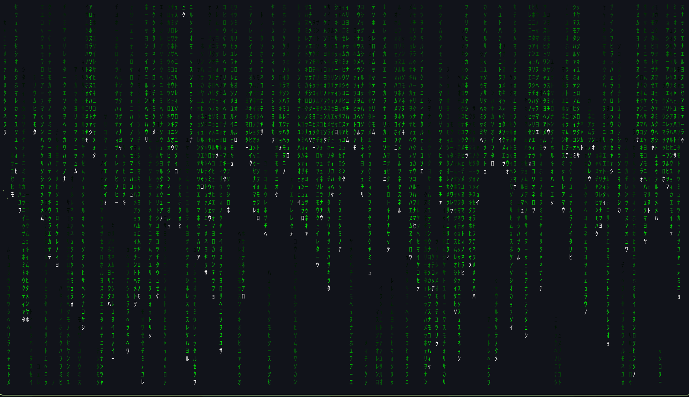

# hyprland-rusty-rain-jap

Version **0.1.0** — first release.



Live fullscreen rain inside the DMS session lock. It uses the half-width Japanese character set from `rusty-rain 0.3.4 -c jap -C green -H white -s`, green trails, white heads and fading tails. This is a Qt Quick rendering of that style, not the rusty-rain executable or a video.

A key, click, scroll or mouse movement dismisses the rain and reveals the existing DMS password prompt. Dismissing the animation does not unlock the session. The animation starts 60 seconds after each lock. Unlocking before then cancels the timer. Monitor power-off on lock and post-lock display timeouts are disabled so the rain stays visible.

## One-command install (Arch Linux / Arch-based Hyprland)

Clone the repository and run:

```sh
git clone https://github.com/mir4zul/hyprland-rusty-rain-jap.git
cd hyprland-rusty-rain-jap
bash setup.sh
```

Run as your normal desktop user. Missing Python, DMS, Quickshell, Japanese fonts and Qt multimedia are installed through pacman. Installing packages uses `sudo pacman -Syu --needed`: pacman displays the full transaction (including system upgrades) and asks for confirmation. Internet access and sudo privileges are needed if dependencies are missing. DMS includes a desktop shell/bar as well as a lock screen.

The script validates the DMS lock code, installs rain, enables the DMS user service and starts it. A repeat run keeps the existing rain installation and original backup. Use `bash setup.sh --check` to inspect dependencies and compatibility without changing anything.

Lock using the DMS menu or:

```sh
dms ipc call lock lock
```

Existing keybindings or idle rules that run `hyprlock` continue using that separate locker. Change those commands to `dms ipc call lock lock` if you want rain on those paths. This installer does not rewrite arbitrary personal Hyprland/idle configurations.

Requires an existing Hyprland session with a working systemd graphical session. Other distributions are currently unsupported by the automatic dependency installer. Existing alternative desktop shells/notification daemons may conflict with DMS; an activation failure is reported, not hidden.

## Manual install (dependencies already installed)

Requires DMS, Quickshell/Qt Quick, Python 3, a Japanese-capable font, and the `dms` systemd user service. Run while unlocked:

```sh
python3 install.py --check
python3 install.py
systemctl --user daemon-reload
systemctl --user restart dms
```

For a different DMS source location, pass `--source /path/to/dms`. The installer validates the expected LockSurface structure before modifying configuration. It copies DMS into your user configuration and backs up an existing user DMS copy. The rain copy does not automatically receive system DMS updates: uninstall and reinstall to refresh it. Incompatible versions are rejected.

## Remove

While unlocked:

```sh
python3 install.py --uninstall
systemctl --user daemon-reload
systemctl --user restart dms
```

The previous user DMS configuration is restored if one existed. Changed settings are restored if they still match the values installed by this tool. The disabled rain copy is retained beside the DMS config.

## Preview

```sh
qml preview.qml
```

The preview is a normal window, not a lock. Press a key or move the mouse to close it.

## Verification and limits

See [TEST-REPORT.md](TEST-REPORT.md) for the exact tests and remaining gaps. Fresh-install activation failures restore the prior rain configuration and service enable/running state; installed system packages are retained.

Validated shell syntax, dependency preflight, DMS patch compatibility, isolated install/uninstall, and the active setup on the author's machine. A clean-machine package installation has not been tested. Package availability, DMS versions and existing desktop configuration can affect setup.

Package reference: https://archlinux.org/packages/extra/x86_64/dms-shell/
